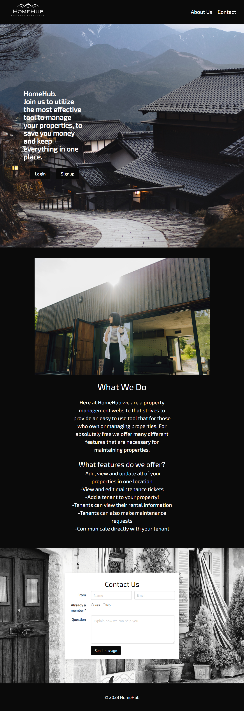
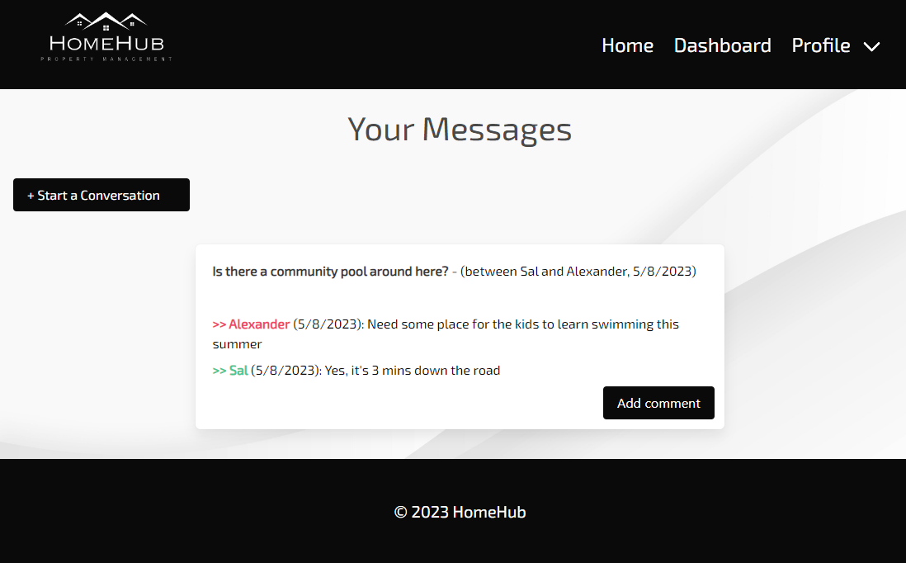

# HomeHub
Property Management

## Description

This application is designed to simplify the management of properties. A landlord will be able to track their properties and add new ones, invite tenants and assign them to a unit, receive maintenance requests, and communicate with their tenants.

This app allows a tenant to check their rented unit details, submit maintenance tickets to their landlord, and communicate with them through a messaging system.

## Table of Contents

- [Installation](#installation)
- [Usage](#usage)
- [Credits](#credits)
- [License](#license)

## Installation

This application runs on the browser.

To run the code locally:
- Clone the repository.
- Download required packages: npm i.
- Run the schema file to create the database.
- Seed the tables: node seeds/seed.
- Run the application: node server.

## Usage

The link to access the deploy application is: 
 
- Create an account or login as a landlord. The dashboard will show the following options:
    * Your properties: Displays current units, allows to add new property and invite tenants.
    * Maintenance tickets: Displays a list of maintenance tickets for your properties. Allows the landlord to update them.
    * Your messages: Shows the conversations with your tenants. Allows the landlord to start a new conversation.
    * Update profile: Allows the landlord to update their profile info, including their password. Displays a list of their current tenants.

- Sign in as a tenant. The dashboard has the following items:
    * Your unit: Lists information about your unit.
    * Your maintenance tickets: Displays a list of the maintenance tickets the tenant has sent.
    * Add maintenance ticket: Opens a window to create a new maintenance ticket.
    * Your messages: Shows tenant-landlord conversations. Allows to start a new one.
    * Update your profile: The tenant can update email/password for their account.

The website looks like the following images:

## Credits

Team:
- Alyssa Geria (https://github.com/alyssageria)
- Jamin Hogan (https://github.com/JaminHLO)
- Nick Pham (https://github.com/NganPham89)
- Anabel Espinoza (https://github.com/Anabel-Espinoza)

Instruction Team:
- Instructor: Saurav Khatiwada
- TAs: Andres Inciarte, Morgan Riley, Constan Fernando, Andres Jimenez.

## License

Project under MIT license.